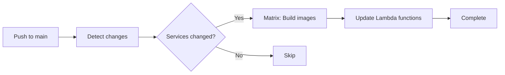
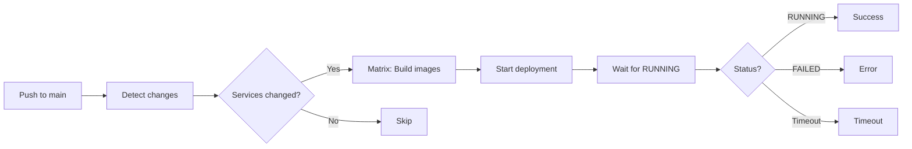

# GitHub Actions CI/CD Guide

Complete guide to GitHub Actions workflows for automated deployment of Lambda and AppRunner services.

---

## Overview

This project includes GitHub Actions workflows for automated deployment:

- **[deploy-lambda.yaml](../.github/workflows/deploy-lambda.yaml)** - Deploy Lambda services
- **[deploy-apprunner.yaml](../.github/workflows/deploy-apprunner.yaml)** - Deploy App Runner services
- **[terraform-deploy.yaml](../.github/workflows/terraform-deploy.yaml)** - Validate, deploy, and test infrastructure
- **[deploy-eks.yaml](../.github/workflows/deploy-eks.yaml)** - Deploy EKS services (optional)
- **[release-please.yml](../.github/workflows/release-please.yml)** - Automated versioning and releases

All workflows support:
- ✅ **Multi-service deployment** - Deploy multiple services in parallel
- ✅ **Auto-detection** - Automatically detect which services changed
- ✅ **Manual triggers** - Deploy specific services or all services
- ✅ **OIDC authentication** - No AWS credentials in code
- ✅ **Matrix strategy** - Parallel service deployments
- ✅ **Resource tagging** - Automatic tagging for cost allocation (see [TAGGING-STRATEGY.md](TAGGING-STRATEGY.md))
- ✅ **GitHub Deployments** - Track deployment history and status

---

## GitHub Deployment Records

All workflows integrate with the **GitHub Deployments API** to provide deployment tracking and visibility directly in the GitHub UI.

### What are GitHub Deployments?

GitHub Deployments create a permanent record of each deployment with:

- **Environment tracking** - Each service/environment combination is tracked separately
- **Deployment status** - Success, failure, or in-progress states
- **Environment URLs** - Direct links to deployed services (AWS Console, API Gateway, etc.)
- **Deployment history** - Complete timeline of all deployments
- **Commit association** - Link deployments to specific commits and PRs

### Viewing Deployment Records

**Repository → Environments tab:**

- View all environments (e.g., `dev-api`, `prod-runner`, `test-infrastructure`)
- See latest deployment status for each environment
- Access deployment URLs with one click

**Pull Request → Checks tab:**

- See which environments will be affected by the PR
- View deployment status during and after merge

**Repository → Deployments (via API or GitHub CLI):**

```bash
# List recent deployments
gh api repos/:owner/:repo/deployments

# View specific deployment
gh api repos/:owner/:repo/deployments/:deployment_id
```

### Deployment Naming Convention

Environments are named by combining the target environment and service:

- **Lambda services**: `dev-api`, `prod-worker`, `test-processor`
- **AppRunner services**: `dev-runner`, `prod-web`, `test-apprunner`
- **Infrastructure**: `dev-infrastructure`, `prod-infrastructure`

This allows tracking each service deployment independently.

### Benefits

1. **Visibility** - See deployment history at a glance
2. **Auditing** - Track who deployed what and when
3. **Rollback context** - Identify which version to rollback to
4. **Integration** - Works with GitHub's native UI and API
5. **No configuration** - Automatically enabled for all workflows

---

## Related Documentation

- [TAGGING-STRATEGY.md](TAGGING-STRATEGY.md) - AWS resource tagging strategy
- [MULTI-SERVICE-TESTING-GUIDE.md](MULTI-SERVICE-TESTING-GUIDE.md) - Testing multi-service deployments
- [SCRIPTS.md](SCRIPTS.md) - Helper scripts including test-health.sh

---

## Table of Contents

- [GitHub Deployment Records](#github-deployment-records)
- [Prerequisites](#prerequisites)
- [Repository Configuration](#repository-configuration)
- [Lambda Deployment Workflow](#lambda-deployment-workflow)
- [AppRunner Deployment Workflow](#apprunner-deployment-workflow)
- [Terraform Deployment Workflow](#terraform-deployment-workflow)
- [Manual Deployment](#manual-deployment)
- [Automated Deployment](#automated-deployment)
- [Rollback Guide](#rollback-guide)
- [Troubleshooting](#troubleshooting)

---

## Prerequisites

### 1. Bootstrap Infrastructure

Ensure bootstrap infrastructure is deployed:

```bash
cd bootstrap
terraform apply
```

**Required resources:**
- GitHub Actions OIDC roles (per environment)
- ECR repository
- Lambda/AppRunner IAM roles

### 2. Application Infrastructure

Deploy initial application infrastructure:

```bash
cd terraform
terraform init -backend-config=backends/backend-dev.hcl
terraform apply -var-file=environments/dev.tfvars
```

This creates the Lambda functions and/or AppRunner services that workflows will update.

---

## Repository Configuration

### Required Secrets

Configure in **Settings → Secrets and variables → Actions**:

**Secrets:**
- `AWS_ACCOUNT_ID` - Your AWS account ID

**Variables:**
- `PROJECT_NAME` - Project name (e.g., `fingus`)
- `AWS_REGION` - AWS region (e.g., `us-east-1`)
- `LAMBDAS` - JSON array of Lambda services (e.g., `["api", "worker"]`)
- `APPRUNNER_SERVICES` - JSON array of AppRunner services (e.g., `["apprunner", "web"]`)

### Environment-Specific Secrets

For each environment (dev, test, production), configure in **Settings → Environments**:

**Environment name:** `dev`, `test`, or `production`

**Environment variables:**
- `AWS_ROLE_ARN_DEV` - ARN of GitHub Actions role for dev
- `AWS_ROLE_ARN_TEST` - ARN of GitHub Actions role for test (optional)
- `AWS_ROLE_ARN_PROD` - ARN of GitHub Actions role for production

**Get role ARNs:**
```bash
cd bootstrap
terraform output github_actions_roles
```

### Example Configuration

**Repository Variables:**
```
PROJECT_NAME=fingus
AWS_REGION=us-east-1
LAMBDAS=["api","worker"]
APPRUNNER_SERVICES=["apprunner","web"]
```

**Repository Secrets:**
```
AWS_ACCOUNT_ID=234876310489
```

**Environment Variables (dev):**
```
AWS_ROLE_ARN_DEV=arn:aws:iam::234876310489:role/fingus-github-actions-dev
```

---

## Lambda Deployment Workflow

### Workflow Overview

**File:** [.github/workflows/deploy-lambda.yaml](../.github/workflows/deploy-lambda.yaml)

**Triggers:**
- Manual: `workflow_dispatch`
- Automatic: Push to `main` with changes in `backend/**`

**Features:**
- Detects which Lambda services changed
- Builds and pushes Docker images using `docker-push.sh`
- Updates Lambda function code with new image
- Deploys multiple services in parallel using matrix strategy

### How It Works

1. **Detect Changes** - Compares changed files against `LAMBDAS` array
2. **Build Images** - Uses `./scripts/docker-push.sh` for each changed service
3. **Update Functions** - Updates Lambda function code with new image URI
4. **Parallel Deployment** - Uses GitHub Actions matrix for parallel deployments

### Example: Manual Deployment

```bash
# Via GitHub UI:
Actions → Deploy Lambda → Run workflow
  Environment: dev
  Services: api,worker  # or "all" or leave empty for auto-detect
```

### Example: Automatic Deployment

```bash
# Make changes to Lambda service
vim backend/api/main.py

# Commit and push
git add backend/api/
git commit -m "feat: add new endpoint"
git push origin main

# Workflow automatically detects 'api' service changed and deploys it
```

### Configuration

**Modify services in repository variables:**
```json
LAMBDAS=["api","worker","scheduler"]
```

---

## AppRunner Deployment Workflow

### Workflow Overview

**File:** [.github/workflows/deploy-apprunner.yaml](../.github/workflows/deploy-apprunner.yaml)

**Triggers:**
- Manual: `workflow_dispatch`
- Automatic: Push to `main` with changes in `backend/**`

**Features:**
- Detects which AppRunner services changed
- Builds and pushes Docker images using `docker-push.sh`
- Triggers AppRunner deployment
- Waits for deployment to complete (with timeout)

### How It Works

1. **Detect Changes** - Compares changed files against `APPRUNNER_SERVICES` array
2. **Build Images** - Uses `./scripts/docker-push.sh` for each changed service
3. **Start Deployment** - Calls `aws apprunner start-deployment`
4. **Wait for Completion** - Polls service status until RUNNING (max 10 minutes)
5. **Output Service URL** - Displays deployed service URL

### Example: Manual Deployment

```bash
# Via GitHub UI:
Actions → Deploy App Runner → Run workflow
  Environment: dev
  Services: apprunner,web  # or "all" or leave empty for auto-detect
```

### Example: Automatic Deployment

```bash
# Make changes to AppRunner service
vim backend/apprunner/main.py

# Commit and push
git add backend/apprunner/
git commit -m "feat: update health endpoint"
git push origin main

# Workflow automatically detects 'apprunner' service changed and deploys it
```

### Configuration

**Modify services in repository variables:**
```json
APPRUNNER_SERVICES=["apprunner","web","admin"]
```

---

## Manual Deployment

### Deploy All Services

**Lambda:**
```bash
Actions → Deploy Lambda → Run workflow
  Environment: dev
  Services: all
```

**AppRunner:**
```bash
Actions → Deploy App Runner → Run workflow
  Environment: dev
  Services: all
```

### Deploy Specific Services

**Single service:**
```
Services: api
```

**Multiple services:**
```
Services: api,worker,scheduler
```

**Auto-detect changes:**
```
Services: (leave empty)
```

---

## Terraform Deployment Workflow

### Terraform Workflow Overview

**File:** [.github/workflows/terraform-deploy.yaml](../.github/workflows/terraform-deploy.yaml)

**Triggers:**

- Manual: `workflow_dispatch` with environment and action selection
- Automatic: Push to `main` with changes in `terraform/**`
- Pull Request: PRs targeting `main` with changes in `terraform/**`

**Features:**

- Validates and formats Terraform code
- Creates execution plans with detailed output
- Applies infrastructure changes (manual or automatic)
- Runs health checks after successful deployment
- Comments plan output on pull requests
- Tests all deployed services using `test-health.sh`

### Terraform Workflow Steps

1. **Terraform Validation** - Format check, init, validate
2. **Terraform Plan** - Creates execution plan, detects changes
3. **PR Comment** - Posts plan output to pull request (if PR trigger)
4. **Terraform Apply** - Applies changes (on workflow_dispatch with action=apply or push to main)
5. **Health Check** - Runs `test-health.sh` to verify all services are healthy
6. **Deployment Summary** - Overall status and service URLs

### Example: Manual Terraform Deployment

```bash
# Via GitHub UI:
Actions → Terraform Deploy & Test → Run workflow
  Environment: dev
  Action: plan  # or "apply" to deploy changes
  Service filter: all  # or specific service like "api"
```

### Example: Automatic Terraform Deployment

```bash
# Make changes to Terraform configuration
vim terraform/lambda-api.tf

# Commit and push
git add terraform/
git commit -m "feat: update Lambda memory size"
git push origin main

# Workflow automatically:
# 1. Validates Terraform
# 2. Creates plan
# 3. Applies changes (on main branch)
# 4. Tests all services with test-health.sh
```

### Health Check Integration

After successful Terraform apply, the workflow automatically:
- Waits 30 seconds for services to stabilize
- Runs `./scripts/test-health.sh` to verify deployment
- Tests all Lambda and AppRunner services
- Validates API Gateway routing
- Reports pass/fail status

See [MULTI-SERVICE-TESTING-GUIDE.md](MULTI-SERVICE-TESTING-GUIDE.md) for detailed testing documentation.

---

## Automated Deployment

### On Push to Main

Workflows automatically run when changes are pushed to `main` branch:

```bash
# Make changes
vim backend/api/main.py
vim backend/apprunner/main.py

# Commit and push
git add backend/
git commit -m "feat: update services"
git push origin main

# Both workflows run:
# - deploy-lambda.yaml detects 'api' changed → deploys Lambda 'api'
# - deploy-apprunner.yaml detects 'apprunner' changed → deploys AppRunner 'apprunner'
```

### Change Detection Logic

**Lambda workflow:**
- Checks if files in `backend/{service}/` changed
- Compares against `LAMBDAS` array
- Only deploys Lambda services that have changes

**AppRunner workflow:**
- Checks if files in `backend/{service}/` changed
- Compares against `APPRUNNER_SERVICES` array
- Only deploys AppRunner services that have changes

**Example:**
```
Changed files:
  backend/api/main.py
  backend/worker/jobs.py

LAMBDAS=["api","worker","scheduler"]
APPRUNNER_SERVICES=["apprunner","web"]

Result:
  → Deploy Lambda: api, worker
  → Deploy AppRunner: (none)
```

---

## Deployment Flow

### Lambda Deployment



### AppRunner Deployment



---

## Workflow Architecture

### Multi-Service Matrix Strategy

Both workflows use GitHub Actions matrix strategy for parallel deployments:

```yaml
strategy:
  matrix:
    service: ${{ fromJSON(needs.detect-changes.outputs.services) }}
```

**Example execution:**
```
Services to deploy: ["api", "worker", "scheduler"]

Matrix creates 3 parallel jobs:
  Job 1: Deploy 'api'
  Job 2: Deploy 'worker'
  Job 3: Deploy 'scheduler'
```

**Benefits:**
- Faster deployments (parallel vs. sequential)
- Independent service failures
- Clear per-service logs

### Image Tagging Strategy

Both workflows use the centralized `docker-push.sh` script:

```bash
./scripts/docker-push.sh $ENVIRONMENT $SERVICE $DOCKERFILE

# Creates tags:
# - {service}-{env}-latest
# - {service}-{env}-{datetime}-{git-sha}

# Example:
# - api-dev-latest
# - api-dev-2025-11-23-abc1234
```

**Benefits:**
- Consistent tagging across all environments
- Rollback capability (datetime tags)
- Clear versioning (git SHA)

---

## Troubleshooting

### Workflow Fails: "Services array is empty"

**Problem:** `LAMBDAS` or `APPRUNNER_SERVICES` is empty or not set

**Solution:**
```bash
# Set repository variable
Settings → Secrets and variables → Actions → Variables

Add new variable:
  Name: LAMBDAS
  Value: ["api"]

# Or for AppRunner:
  Name: APPRUNNER_SERVICES
  Value: ["apprunner"]
```

### Workflow Fails: "Role not found"

**Problem:** GitHub Actions OIDC role doesn't exist or ARN is wrong

**Solution:**
```bash
# Get correct ARN from bootstrap
cd bootstrap
terraform output github_actions_roles

# Set environment variable
Settings → Environments → dev → Variables
  Name: AWS_ROLE_ARN_DEV
  Value: arn:aws:iam::123456789:role/project-github-actions-dev
```

### Workflow Fails: "Lambda function does not exist"

**Problem:** Lambda function not created by Terraform

**Solution:**
```bash
# Create Lambda service
./scripts/setup-terraform-lambda.sh api

# Deploy infrastructure
cd terraform
terraform apply -var-file=environments/dev.tfvars

# Then retry workflow
```

### Workflow Fails: "App Runner service not found"

**Problem:** AppRunner service not created by Terraform

**Solution:**
```bash
# Create AppRunner service
./scripts/setup-terraform-apprunner.sh apprunner

# Deploy infrastructure
cd terraform
terraform apply -var-file=environments/dev.tfvars

# Then retry workflow
```

### AppRunner Deployment Times Out

**Problem:** Deployment takes longer than 10 minutes

**Solution:**
```bash
# Check service status manually
aws apprunner describe-service \
  --service-arn arn:aws:apprunner:us-east-1:123:service/name \
  --query 'Service.Status'

# Check service logs
aws logs tail /aws/apprunner/project-env-service --follow
```

### Service Didn't Auto-Deploy

**Problem:** Changed files but workflow didn't detect service

**Solution:**
```bash
# Verify service is in array
echo $LAMBDAS  # or $APPRUNNER_SERVICES

# Verify file path matches pattern
# Correct: backend/api/main.py
# Wrong: backend/api.py

# Manual deploy as workaround
Actions → Deploy [Lambda|App Runner] → Run workflow
  Services: api
```

---

## Best Practices

### 1. Use Feature Branches

```bash
# Create feature branch
git checkout -b feature/new-endpoint

# Make changes
vim backend/api/main.py

# Push to feature branch (workflows won't run)
git push origin feature/new-endpoint

# Create PR, merge to main (workflows run automatically)
```

### 2. Test Before Deploying

```bash
# Test locally
cd backend/api
uv sync
uv run pytest

# Build and test Docker image
./scripts/docker-push.sh dev api Dockerfile.lambda

# Then deploy via PR merge
```

### 3. Monitor Deployments

```bash
# Watch workflow in real-time
Actions → [Workflow name] → [Run] → Live logs

# Check Lambda logs
aws logs tail /aws/lambda/project-dev-api --follow

# Check AppRunner logs
aws logs tail /aws/apprunner/project-dev-apprunner --follow
```

### 4. Use Environments for Protection

```bash
# Settings → Environments → production
# Add protection rules:
  ✓ Required reviewers: 2
  ✓ Wait timer: 5 minutes
  ✓ Deployment branches: main only
```

---

## Advanced Usage

### Custom Deployment Script

Extend `docker-push.sh` for custom build steps:

```bash
# scripts/docker-push.sh
# Add custom build args, multi-stage builds, etc.
```

### Notification Integration

Add Slack/Discord notifications:

```yaml
- name: Notify deployment
  if: success()
  uses: slackapi/slack-github-action@v1
  with:
    payload: |
      {
        "text": "Deployed ${{ matrix.service }} to ${{ env.ENVIRONMENT }}"
      }
```

### Rollback Strategy

See the [Rollback Guide](#rollback-guide) section below for complete rollback procedures.

---

## Rollback Guide

This section provides comprehensive instructions for rolling back deployments when issues are detected.

### Overview

The project supports rollback at two levels:
- **Backend Services** - Roll back Lambda or AppRunner service code to a previous Docker image
- **Infrastructure** - Roll back Terraform-managed infrastructure changes

Both rollback methods preserve data and configuration while reverting problematic changes.

---

### Backend Service Rollback

Roll back Lambda or AppRunner services to a previous Docker image version.

#### Understanding Image Tags

The `docker-push.sh` script creates multiple tags for each deployment:

```
Primary tag:    {service}-{env}-{datetime}-{git-sha}
Service latest: {service}-{env}-latest
Env latest:     {env}-latest

Example:
  api-dev-2025-11-26-14-30-abc1234  (timestamped, immutable)
  api-dev-latest                     (always points to latest)
  dev-latest                         (environment latest)
```

**Key points:**
- Timestamped tags (with git SHA) are **immutable** and safe for rollback
- `latest` tags are **mutable** and not suitable for rollback targets
- All tags are pushed to the same ECR repository

#### Step 1: List Available Image Versions

**Find recent images for a specific service:**

```bash
# Set variables
export PROJECT_NAME="fingus"
export AWS_REGION="us-east-1"
export ENVIRONMENT="dev"
export SERVICE="api"

# List recent images for this service
aws ecr describe-images \
  --repository-name ${PROJECT_NAME} \
  --region ${AWS_REGION} \
  --query "reverse(sort_by(imageDetails[?contains(imageTags[0], '${SERVICE}-${ENVIRONMENT}-')], &imagePushedAt))[0:10].{Tag:imageTags[0],Pushed:imagePushedAt}" \
  --output table
```

**Example output:**
```
-----------------------------------------------------------
|                    DescribeImages                       |
+------------------------------------------+--------------+
|                   Pushed                 |     Tag      |
+------------------------------------------+--------------+
|  2025-11-26T14:30:00.000Z               |  api-dev-2025-11-26-14-30-abc1234  |
|  2025-11-26T12:15:00.000Z               |  api-dev-2025-11-26-12-15-def5678  |
|  2025-11-25T18:45:00.000Z               |  api-dev-2025-11-25-18-45-ghi9012  |
+------------------------------------------+--------------+
```

**Find all images in the repository:**

```bash
aws ecr describe-images \
  --repository-name ${PROJECT_NAME} \
  --region ${AWS_REGION} \
  --query 'reverse(sort_by(imageDetails, &imagePushedAt))[0:20].{Tags:imageTags[0],Pushed:imagePushedAt,Size:imageSizeInBytes}' \
  --output table
```

#### Step 2: Rollback Lambda Function

**Get current Lambda configuration:**

```bash
aws lambda get-function \
  --function-name ${PROJECT_NAME}-${ENVIRONMENT}-${SERVICE} \
  --region ${AWS_REGION} \
  --query 'Configuration.{Image:ImageUri,Memory:MemorySize,Timeout:Timeout}' \
  --output table
```

**Rollback to a specific image tag:**

```bash
# Choose the target image tag from Step 1
export TARGET_TAG="api-dev-2025-11-25-18-45-ghi9012"

# Build the full image URI
export IMAGE_URI="${AWS_ACCOUNT_ID}.dkr.ecr.${AWS_REGION}.amazonaws.com/${PROJECT_NAME}:${TARGET_TAG}"

# Update Lambda function
aws lambda update-function-code \
  --function-name ${PROJECT_NAME}-${ENVIRONMENT}-${SERVICE} \
  --image-uri ${IMAGE_URI} \
  --region ${AWS_REGION}

# Wait for update to complete
aws lambda wait function-updated \
  --function-name ${PROJECT_NAME}-${ENVIRONMENT}-${SERVICE} \
  --region ${AWS_REGION}

echo "✅ Lambda function rolled back to ${TARGET_TAG}"
```

**Verify the rollback:**

```bash
# Check function status
aws lambda get-function \
  --function-name ${PROJECT_NAME}-${ENVIRONMENT}-${SERVICE} \
  --region ${AWS_REGION} \
  --query 'Configuration.{State:State,Image:ImageUri,LastModified:LastModified}'

# Test the function via API Gateway
curl -i https://YOUR_API_GATEWAY_URL/${SERVICE}/health
```

#### Step 3: Rollback AppRunner Service

**Get current AppRunner configuration:**

```bash
# Find service ARN
SERVICE_ARN=$(aws apprunner list-services \
  --region ${AWS_REGION} \
  --query "ServiceSummaryList[?ServiceName=='${PROJECT_NAME}-${ENVIRONMENT}-${SERVICE}'].ServiceArn" \
  --output text)

# Get current service details
aws apprunner describe-service \
  --service-arn ${SERVICE_ARN} \
  --region ${AWS_REGION} \
  --query 'Service.{Status:Status,Image:SourceConfiguration.ImageRepository.ImageIdentifier,Updated:UpdatedAt}'
```

**Rollback to a specific image tag:**

```bash
# Choose the target image tag from Step 1
export TARGET_TAG="runner-dev-2025-11-25-18-45-ghi9012"

# Build the full image URI
export IMAGE_URI="${AWS_ACCOUNT_ID}.dkr.ecr.${AWS_REGION}.amazonaws.com/${PROJECT_NAME}:${TARGET_TAG}"

# Note: AppRunner doesn't support direct image updates
# You must update via Terraform or redeploy the service

# Option 1: Update via Terraform (recommended)
cd terraform
terraform apply \
  -var="runner_image_tag=${TARGET_TAG}" \
  -var-file=environments/${ENVIRONMENT}.tfvars \
  -target=aws_apprunner_service.runner

# Option 2: Trigger deployment with existing configuration (uses ECR latest)
aws apprunner start-deployment \
  --service-arn ${SERVICE_ARN} \
  --region ${AWS_REGION}
```

**For manual image tag update (not recommended):**

```bash
# This requires updating the Terraform state or using AWS Console
# It's better to use Terraform to ensure consistency
echo "⚠️  For AppRunner, use Terraform rollback (see Infrastructure Rollback section)"
```

**Monitor AppRunner deployment:**

```bash
# Watch deployment status
watch -n 10 'aws apprunner describe-service \
  --service-arn ${SERVICE_ARN} \
  --query "Service.{Status:Status,Updated:UpdatedAt}" \
  --output table'

# Check logs
aws logs tail /aws/apprunner/${PROJECT_NAME}-${ENVIRONMENT}-${SERVICE} --follow
```

---

### Infrastructure Rollback

Roll back Terraform-managed infrastructure changes to a previous state.

#### Understanding Terraform State

Terraform maintains infrastructure state in S3 (configured via bootstrap):
- State file: `s3://{project}-terraform-state-{env}/{project}-{env}.tfstate`
- State history is versioned in S3
- Local Terraform workspace contains plan files

#### State Backup Protection

The Terraform deployment workflow **automatically creates state backups** before every apply operation:

**GitHub Actions workflow backups:**

- Creates local state backup before each `terraform apply`
- Uploads backup as workflow artifact (90-day retention)
- For **production**: Also saves backup to S3 with metadata
- Backup filename format: `tfstate-backup-{env}-{timestamp}-{commit-sha}.json`

**Access backups:**

```bash
# List workflow artifacts (GitHub CLI)
gh run list --workflow=terraform-deploy.yaml

# Download specific run artifacts
gh run download <run-id>

# List production backups in S3
aws s3 ls s3://fingus-terraform-state-production/backups/

# Download production backup
aws s3 cp s3://fingus-terraform-state-production/backups/tfstate-backup-production-20251126-143000-abc1234.json ./
```

**Restore state from backup:**

```bash
# Using the restore script
./scripts/restore-terraform-state.sh production tfstate-backup-production-20251126-143000-abc1234.json

# Or from S3
./scripts/restore-terraform-state.sh production s3://fingus-terraform-state-production/backups/tfstate-backup-production-20251126-143000-abc1234.json

# Manual restore
cd terraform
terraform state push state-backup-file.json
```

**When to use state backups:**

- After a failed or problematic deployment
- When state becomes corrupted
- To investigate historical infrastructure state
- Emergency recovery scenarios

**Important notes:**

- State backups are point-in-time snapshots
- Restoring state doesn't change actual AWS resources
- After restore, run `terraform plan` to see infrastructure drift
- Always create a safety backup before restoring

#### Method 1: Rollback via Git and Terraform

**This is the recommended approach for most rollbacks.**

**Step 1: Identify the target commit**

```bash
# View recent infrastructure changes
git log --oneline --all -- terraform/ | head -20

# Example output:
# c973416 API Gateway Multi Service Integration
# 7bb31cc Workflows Update
# 3651ab6 Terraform Deploy Workflow
```

**Step 2: Review the changes**

```bash
# See what changed in a specific commit
git show <commit-sha> -- terraform/

# Compare current state to previous commit
git diff <commit-sha> HEAD -- terraform/
```

**Step 3: Checkout previous Terraform configuration**

```bash
# Create a rollback branch
git checkout -b rollback-infrastructure-$(date +%Y%m%d)

# Checkout Terraform files from target commit
git checkout <commit-sha> -- terraform/

# Review changes
git status
git diff --cached
```

**Step 4: Plan the rollback**

```bash
cd terraform

# Initialize if needed
terraform init -backend-config=environments/${ENVIRONMENT}-backend.hcl

# Create rollback plan
terraform plan \
  -var-file=environments/${ENVIRONMENT}.tfvars \
  -out=rollback.tfplan

# Review the plan carefully
terraform show rollback.tfplan
```

**Step 5: Apply the rollback**

```bash
# Apply the rollback plan
terraform apply rollback.tfplan

# Verify outputs
terraform output
```

**Step 6: Commit the rollback**

```bash
# Commit the rollback
git add terraform/
git commit -m "rollback: revert infrastructure to commit <commit-sha>

Reason: <describe why rollback was needed>
Target: <commit-sha>
Environment: ${ENVIRONMENT}"

# Push and create PR
git push origin rollback-infrastructure-$(date +%Y%m%d)

# Create PR for review
gh pr create --title "Rollback infrastructure to <commit-sha>" \
  --body "Rolling back infrastructure changes due to: <reason>"
```

#### Method 2: Rollback via Terraform State (Advanced)

**Use this method only when git history rollback is not sufficient.**

**Step 1: List state file versions**

```bash
# Set variables
export STATE_BUCKET="${PROJECT_NAME}-terraform-state-${ENVIRONMENT}"
export STATE_KEY="${PROJECT_NAME}-${ENVIRONMENT}.tfstate"

# List versions (requires S3 versioning enabled)
aws s3api list-object-versions \
  --bucket ${STATE_BUCKET} \
  --prefix ${STATE_KEY} \
  --query 'Versions[].{Version:VersionId,Modified:LastModified,Size:Size}' \
  --output table
```

**Step 2: Download previous state version**

```bash
# Choose target version ID from list above
export TARGET_VERSION="<version-id>"

# Download the previous state
aws s3api get-object \
  --bucket ${STATE_BUCKET} \
  --key ${STATE_KEY} \
  --version-id ${TARGET_VERSION} \
  previous-state.tfstate
```

**Step 3: Review state differences**

```bash
# Compare current and previous states
terraform show
terraform show -json | jq '.' > current-state.json

terraform show previous-state.tfstate
terraform show -json previous-state.tfstate | jq '.' > previous-state.json

# Compare
diff -u previous-state.json current-state.json | less
```

**Step 4: Create plan to match previous state**

```bash
# Import the previous state (DANGER: This replaces current state)
# ONLY do this if you're certain
cp previous-state.tfstate terraform.tfstate.backup
terraform state push previous-state.tfstate

# Plan to match the state
terraform plan -var-file=environments/${ENVIRONMENT}.tfvars
```

**⚠️ WARNING:** Direct state manipulation is dangerous. Always:
- Backup current state first
- Test in dev environment
- Have team review the plan
- Consider using `git checkout` method instead

#### Method 3: Selective Resource Rollback

**Rollback specific resources without affecting others.**

**Step 1: Identify the resource to rollback**

```bash
# List all resources in state
terraform state list

# Example resources:
# aws_lambda_function.api
# aws_apprunner_service.runner
# aws_apigatewayv2_api.main
```

**Step 2: View resource configuration from previous commit**

```bash
# Show resource definition from target commit
git show <commit-sha>:terraform/lambda-api.tf

# Or for AppRunner
git show <commit-sha>:terraform/apprunner-runner.tf
```

**Step 3: Update specific resource files**

```bash
# Checkout specific file from previous commit
git checkout <commit-sha> -- terraform/lambda-api.tf

# Plan only this resource
terraform plan \
  -var-file=environments/${ENVIRONMENT}.tfvars \
  -target=aws_lambda_function.api
```

**Step 4: Apply targeted rollback**

```bash
# Apply changes to specific resource
terraform apply \
  -var-file=environments/${ENVIRONMENT}.tfvars \
  -target=aws_lambda_function.api \
  -auto-approve

# Verify
terraform state show aws_lambda_function.api
```

---

### Rollback Testing and Verification

#### Health Check After Rollback

```bash
# Run comprehensive health checks
./scripts/test-health.sh ${ENVIRONMENT} ${PROJECT_NAME} all

# Or test specific service
./scripts/test-health.sh ${ENVIRONMENT} ${PROJECT_NAME} ${SERVICE}
```

#### Manual Verification

**Lambda Function:**

```bash
# Invoke function directly
aws lambda invoke \
  --function-name ${PROJECT_NAME}-${ENVIRONMENT}-${SERVICE} \
  --region ${AWS_REGION} \
  response.json

cat response.json

# Check via API Gateway
curl -i https://<api-gateway-url>/${SERVICE}/health
```

**AppRunner Service:**

```bash
# Get service URL
SERVICE_URL=$(aws apprunner describe-service \
  --service-arn ${SERVICE_ARN} \
  --query 'Service.ServiceUrl' \
  --output text)

# Test endpoint
curl -i https://${SERVICE_URL}/health
```

**Infrastructure:**

```bash
# Verify Terraform state matches configuration
cd terraform
terraform plan -var-file=environments/${ENVIRONMENT}.tfvars

# Should show: "No changes. Your infrastructure matches the configuration."
```

#### Monitoring After Rollback

```bash
# Watch Lambda logs
aws logs tail /aws/lambda/${PROJECT_NAME}-${ENVIRONMENT}-${SERVICE} \
  --follow \
  --since 5m

# Watch AppRunner logs
aws logs tail /aws/apprunner/${PROJECT_NAME}-${ENVIRONMENT}-${SERVICE} \
  --follow \
  --since 5m

# Check CloudWatch metrics
aws cloudwatch get-metric-statistics \
  --namespace AWS/Lambda \
  --metric-name Errors \
  --dimensions Name=FunctionName,Value=${PROJECT_NAME}-${ENVIRONMENT}-${SERVICE} \
  --start-time $(date -u -d '10 minutes ago' +%Y-%m-%dT%H:%M:%S) \
  --end-time $(date -u +%Y-%m-%dT%H:%M:%S) \
  --period 300 \
  --statistics Sum
```

---

### Rollback Scenarios and Solutions

#### Scenario 1: Bad Backend Deployment

**Problem:** Latest Lambda/AppRunner deployment has bugs or errors

**Solution:** Backend service rollback (Method 1)

```bash
# Quick rollback to previous version
export TARGET_TAG="api-dev-2025-11-25-18-45-ghi9012"  # Last known good
./scripts/rollback-service.sh ${ENVIRONMENT} ${SERVICE} ${TARGET_TAG}

# Or manually:
aws lambda update-function-code \
  --function-name ${PROJECT_NAME}-${ENVIRONMENT}-${SERVICE} \
  --image-uri ${AWS_ACCOUNT_ID}.dkr.ecr.${AWS_REGION}.amazonaws.com/${PROJECT_NAME}:${TARGET_TAG}
```

**Verification:**
```bash
./scripts/test-health.sh ${ENVIRONMENT} ${PROJECT_NAME} ${SERVICE}
```

#### Scenario 2: Infrastructure Change Broke Services

**Problem:** Terraform apply changed configuration that broke services

**Solution:** Infrastructure rollback via Git (Method 1)

```bash
# Find the breaking commit
git log --oneline -- terraform/ | head -10

# Rollback to previous working commit
git checkout -b rollback-infra
git checkout <good-commit-sha> -- terraform/

# Apply rollback
cd terraform
terraform plan -var-file=environments/${ENVIRONMENT}.tfvars
terraform apply -var-file=environments/${ENVIRONMENT}.tfvars
```

#### Scenario 3: Partial Service Failure

**Problem:** One service of many is failing after deployment

**Solution:** Selective service rollback

```bash
# Rollback only the failing service
export FAILING_SERVICE="worker"
export TARGET_TAG="worker-dev-2025-11-25-18-45-ghi9012"

# Rollback Lambda
aws lambda update-function-code \
  --function-name ${PROJECT_NAME}-${ENVIRONMENT}-${FAILING_SERVICE} \
  --image-uri ${AWS_ACCOUNT_ID}.dkr.ecr.${AWS_REGION}.amazonaws.com/${PROJECT_NAME}:${TARGET_TAG}

# Other services remain on current version
```

#### Scenario 4: Database Migration Issue

**Problem:** Terraform changed database configuration

**Solution:** Targeted resource rollback + manual intervention

```bash
# DO NOT rollback database destructively
# Instead, rollback application code first
# Then plan database changes separately

# 1. Rollback application services
# 2. Review database changes
git show <commit-sha>:terraform/database.tf

# 3. Manually fix database if needed
# 4. Update Terraform to match

# For state file issues, restore from S3 version
aws s3api list-object-versions --bucket ${STATE_BUCKET} --prefix ${STATE_KEY}
```

#### Scenario 5: Complete Environment Failure

**Problem:** Entire environment is non-functional after changes

**Solution:** Full environment rollback

```bash
# 1. Rollback all backend services to last known good
for service in api worker runner; do
  export TARGET_TAG="${service}-dev-2025-11-25-18-45-ghi9012"
  aws lambda update-function-code \
    --function-name ${PROJECT_NAME}-${ENVIRONMENT}-${service} \
    --image-uri ${AWS_ACCOUNT_ID}.dkr.ecr.${AWS_REGION}.amazonaws.com/${PROJECT_NAME}:${TARGET_TAG} \
    2>/dev/null || echo "Skipping ${service} (may be AppRunner)"
done

# 2. Rollback infrastructure
git checkout <last-good-commit> -- terraform/
cd terraform
terraform apply -var-file=environments/${ENVIRONMENT}.tfvars

# 3. Verify all services
./scripts/test-health.sh ${ENVIRONMENT} ${PROJECT_NAME} all
```

---

### Rollback Best Practices

#### Before Deploying

1. **Tag releases properly** - Ensure meaningful git commits and tags
2. **Test in dev first** - Always test changes in dev before production
3. **Document changes** - Note what changed and why in commit messages
4. **Backup state** - Verify S3 versioning is enabled for state files

#### During Rollback

1. **Communicate** - Notify team of rollback in progress
2. **Use dev environment** - Test rollback procedure in dev first
3. **Monitor metrics** - Watch CloudWatch during rollback
4. **Document reason** - Record why rollback was necessary
5. **Verify thoroughly** - Run health checks after rollback

#### After Rollback

1. **Root cause analysis** - Determine what went wrong
2. **Update tests** - Add tests to prevent regression
3. **Fix forward** - Plan proper fix rather than staying on old version
4. **Review process** - Update deployment procedures if needed

#### Automation Opportunities

Create helper scripts for common rollback scenarios:

**scripts/rollback-service.sh:**
```bash
#!/bin/bash
# Quick service rollback script
ENVIRONMENT=$1
SERVICE=$2
TARGET_TAG=$3

aws lambda update-function-code \
  --function-name ${PROJECT_NAME}-${ENVIRONMENT}-${SERVICE} \
  --image-uri ${AWS_ACCOUNT_ID}.dkr.ecr.${AWS_REGION}.amazonaws.com/${PROJECT_NAME}:${TARGET_TAG}

./scripts/test-health.sh ${ENVIRONMENT} ${PROJECT_NAME} ${SERVICE}
```

---

### Emergency Contacts and Resources

**When rollback fails or help is needed:**

1. **Check troubleshooting guide:** [TROUBLESHOOTING.md](TROUBLESHOOTING.md)
2. **Review AWS logs:** CloudWatch Logs for detailed error messages
3. **Check Terraform state:** Ensure state file is not corrupted
4. **Escalate if needed:** Contact DevOps team or AWS support

**Useful AWS Support Resources:**
- [Lambda Troubleshooting](https://docs.aws.amazon.com/lambda/latest/dg/troubleshooting.html)
- [App Runner Troubleshooting](https://docs.aws.amazon.com/apprunner/latest/dg/troubleshooting.html)
- [Terraform State Recovery](https://developer.hashicorp.com/terraform/tutorials/state/state-recover)

---

## Resources

- [GitHub Actions Documentation](https://docs.github.com/en/actions)
- [AWS OIDC Authentication](https://docs.github.com/en/actions/deployment/security-hardening-your-deployments/configuring-openid-connect-in-amazon-web-services)
- [Matrix Strategy](https://docs.github.com/en/actions/using-jobs/using-a-matrix-for-your-jobs)
- [Workflow Syntax](https://docs.github.com/en/actions/using-workflows/workflow-syntax-for-github-actions)

---

**Last Updated:** 2025-11-26
**Status:** Production Ready ✅
