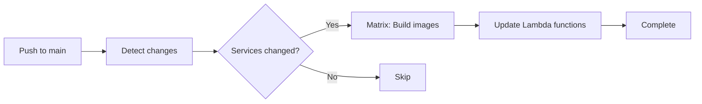
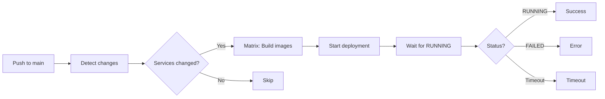

# GitHub Actions CI/CD Guide

Complete guide to GitHub Actions workflows for automated deployment of Lambda and AppRunner services.

---

## Overview

This project includes GitHub Actions workflows for automated deployment:

- **[deploy-lambda.yaml](../.github/workflows/deploy-lambda.yaml)** - Deploy Lambda services
- **[deploy-apprunner.yaml](../.github/workflows/deploy-apprunner.yaml)** - Deploy App Runner services
- **[terraform-deploy.yaml](../.github/workflows/terraform-deploy.yaml)** - Validate, deploy, and test infrastructure
- **[deploy-eks.yaml](../.github/workflows/deploy-eks.yaml)** - Deploy EKS services (optional)
- **[release-please.yml](../.github/workflows/release-please.yml)** - Automated versioning and releases

All workflows support:
- ✅ **Multi-service deployment** - Deploy multiple services in parallel
- ✅ **Auto-detection** - Automatically detect which services changed
- ✅ **Manual triggers** - Deploy specific services or all services
- ✅ **OIDC authentication** - No AWS credentials in code
- ✅ **Matrix strategy** - Parallel service deployments
- ✅ **Resource tagging** - Automatic tagging for cost allocation (see [TAGGING-STRATEGY.md](TAGGING-STRATEGY.md))

---

## Related Documentation

- [TAGGING-STRATEGY.md](TAGGING-STRATEGY.md) - AWS resource tagging strategy
- [MULTI-SERVICE-TESTING-GUIDE.md](MULTI-SERVICE-TESTING-GUIDE.md) - Testing multi-service deployments
- [SCRIPTS.md](SCRIPTS.md) - Helper scripts including test-health.sh

---

## Table of Contents

- [Prerequisites](#prerequisites)
- [Repository Configuration](#repository-configuration)
- [Lambda Deployment Workflow](#lambda-deployment-workflow)
- [AppRunner Deployment Workflow](#apprunner-deployment-workflow)
- [Terraform Deployment Workflow](#terraform-deployment-workflow)
- [Manual Deployment](#manual-deployment)
- [Automated Deployment](#automated-deployment)
- [Troubleshooting](#troubleshooting)

---

## Prerequisites

### 1. Bootstrap Infrastructure

Ensure bootstrap infrastructure is deployed:

```bash
cd bootstrap
terraform apply
```

**Required resources:**
- GitHub Actions OIDC roles (per environment)
- ECR repository
- Lambda/AppRunner IAM roles

### 2. Application Infrastructure

Deploy initial application infrastructure:

```bash
cd terraform
terraform init -backend-config=backends/backend-dev.hcl
terraform apply -var-file=environments/dev.tfvars
```

This creates the Lambda functions and/or AppRunner services that workflows will update.

---

## Repository Configuration

### Required Secrets

Configure in **Settings → Secrets and variables → Actions**:

**Secrets:**
- `AWS_ACCOUNT_ID` - Your AWS account ID

**Variables:**
- `PROJECT_NAME` - Project name (e.g., `fingus`)
- `AWS_REGION` - AWS region (e.g., `us-east-1`)
- `LAMBDAS` - JSON array of Lambda services (e.g., `["api", "worker"]`)
- `APPRUNNER_SERVICES` - JSON array of AppRunner services (e.g., `["apprunner", "web"]`)

### Environment-Specific Secrets

For each environment (dev, test, production), configure in **Settings → Environments**:

**Environment name:** `dev`, `test`, or `production`

**Environment variables:**
- `AWS_ROLE_ARN_DEV` - ARN of GitHub Actions role for dev
- `AWS_ROLE_ARN_TEST` - ARN of GitHub Actions role for test (optional)
- `AWS_ROLE_ARN_PROD` - ARN of GitHub Actions role for production

**Get role ARNs:**
```bash
cd bootstrap
terraform output github_actions_roles
```

### Example Configuration

**Repository Variables:**
```
PROJECT_NAME=fingus
AWS_REGION=us-east-1
LAMBDAS=["api","worker"]
APPRUNNER_SERVICES=["apprunner","web"]
```

**Repository Secrets:**
```
AWS_ACCOUNT_ID=234876310489
```

**Environment Variables (dev):**
```
AWS_ROLE_ARN_DEV=arn:aws:iam::234876310489:role/fingus-github-actions-dev
```

---

## Lambda Deployment Workflow

### Workflow Overview

**File:** [.github/workflows/deploy-lambda.yaml](../.github/workflows/deploy-lambda.yaml)

**Triggers:**
- Manual: `workflow_dispatch`
- Automatic: Push to `main` with changes in `backend/**`

**Features:**
- Detects which Lambda services changed
- Builds and pushes Docker images using `docker-push.sh`
- Updates Lambda function code with new image
- Deploys multiple services in parallel using matrix strategy

### How It Works

1. **Detect Changes** - Compares changed files against `LAMBDAS` array
2. **Build Images** - Uses `./scripts/docker-push.sh` for each changed service
3. **Update Functions** - Updates Lambda function code with new image URI
4. **Parallel Deployment** - Uses GitHub Actions matrix for parallel deployments

### Example: Manual Deployment

```bash
# Via GitHub UI:
Actions → Deploy Lambda → Run workflow
  Environment: dev
  Services: api,worker  # or "all" or leave empty for auto-detect
```

### Example: Automatic Deployment

```bash
# Make changes to Lambda service
vim backend/api/main.py

# Commit and push
git add backend/api/
git commit -m "feat: add new endpoint"
git push origin main

# Workflow automatically detects 'api' service changed and deploys it
```

### Configuration

**Modify services in repository variables:**
```json
LAMBDAS=["api","worker","scheduler"]
```

---

## AppRunner Deployment Workflow

### Workflow Overview

**File:** [.github/workflows/deploy-apprunner.yaml](../.github/workflows/deploy-apprunner.yaml)

**Triggers:**
- Manual: `workflow_dispatch`
- Automatic: Push to `main` with changes in `backend/**`

**Features:**
- Detects which AppRunner services changed
- Builds and pushes Docker images using `docker-push.sh`
- Triggers AppRunner deployment
- Waits for deployment to complete (with timeout)

### How It Works

1. **Detect Changes** - Compares changed files against `APPRUNNER_SERVICES` array
2. **Build Images** - Uses `./scripts/docker-push.sh` for each changed service
3. **Start Deployment** - Calls `aws apprunner start-deployment`
4. **Wait for Completion** - Polls service status until RUNNING (max 10 minutes)
5. **Output Service URL** - Displays deployed service URL

### Example: Manual Deployment

```bash
# Via GitHub UI:
Actions → Deploy App Runner → Run workflow
  Environment: dev
  Services: apprunner,web  # or "all" or leave empty for auto-detect
```

### Example: Automatic Deployment

```bash
# Make changes to AppRunner service
vim backend/apprunner/main.py

# Commit and push
git add backend/apprunner/
git commit -m "feat: update health endpoint"
git push origin main

# Workflow automatically detects 'apprunner' service changed and deploys it
```

### Configuration

**Modify services in repository variables:**
```json
APPRUNNER_SERVICES=["apprunner","web","admin"]
```

---

## Manual Deployment

### Deploy All Services

**Lambda:**
```bash
Actions → Deploy Lambda → Run workflow
  Environment: dev
  Services: all
```

**AppRunner:**
```bash
Actions → Deploy App Runner → Run workflow
  Environment: dev
  Services: all
```

### Deploy Specific Services

**Single service:**
```
Services: api
```

**Multiple services:**
```
Services: api,worker,scheduler
```

**Auto-detect changes:**
```
Services: (leave empty)
```

---

## Terraform Deployment Workflow

### Terraform Workflow Overview

**File:** [.github/workflows/terraform-deploy.yaml](../.github/workflows/terraform-deploy.yaml)

**Triggers:**

- Manual: `workflow_dispatch` with environment and action selection
- Automatic: Push to `main` with changes in `terraform/**`
- Pull Request: PRs targeting `main` with changes in `terraform/**`

**Features:**

- Validates and formats Terraform code
- Creates execution plans with detailed output
- Applies infrastructure changes (manual or automatic)
- Runs health checks after successful deployment
- Comments plan output on pull requests
- Tests all deployed services using `test-health.sh`

### Terraform Workflow Steps

1. **Terraform Validation** - Format check, init, validate
2. **Terraform Plan** - Creates execution plan, detects changes
3. **PR Comment** - Posts plan output to pull request (if PR trigger)
4. **Terraform Apply** - Applies changes (on workflow_dispatch with action=apply or push to main)
5. **Health Check** - Runs `test-health.sh` to verify all services are healthy
6. **Deployment Summary** - Overall status and service URLs

### Example: Manual Terraform Deployment

```bash
# Via GitHub UI:
Actions → Terraform Deploy & Test → Run workflow
  Environment: dev
  Action: plan  # or "apply" to deploy changes
  Service filter: all  # or specific service like "api"
```

### Example: Automatic Terraform Deployment

```bash
# Make changes to Terraform configuration
vim terraform/lambda-api.tf

# Commit and push
git add terraform/
git commit -m "feat: update Lambda memory size"
git push origin main

# Workflow automatically:
# 1. Validates Terraform
# 2. Creates plan
# 3. Applies changes (on main branch)
# 4. Tests all services with test-health.sh
```

### Health Check Integration

After successful Terraform apply, the workflow automatically:
- Waits 30 seconds for services to stabilize
- Runs `./scripts/test-health.sh` to verify deployment
- Tests all Lambda and AppRunner services
- Validates API Gateway routing
- Reports pass/fail status

See [MULTI-SERVICE-TESTING-GUIDE.md](MULTI-SERVICE-TESTING-GUIDE.md) for detailed testing documentation.

---

## Automated Deployment

### On Push to Main

Workflows automatically run when changes are pushed to `main` branch:

```bash
# Make changes
vim backend/api/main.py
vim backend/apprunner/main.py

# Commit and push
git add backend/
git commit -m "feat: update services"
git push origin main

# Both workflows run:
# - deploy-lambda.yaml detects 'api' changed → deploys Lambda 'api'
# - deploy-apprunner.yaml detects 'apprunner' changed → deploys AppRunner 'apprunner'
```

### Change Detection Logic

**Lambda workflow:**
- Checks if files in `backend/{service}/` changed
- Compares against `LAMBDAS` array
- Only deploys Lambda services that have changes

**AppRunner workflow:**
- Checks if files in `backend/{service}/` changed
- Compares against `APPRUNNER_SERVICES` array
- Only deploys AppRunner services that have changes

**Example:**
```
Changed files:
  backend/api/main.py
  backend/worker/jobs.py

LAMBDAS=["api","worker","scheduler"]
APPRUNNER_SERVICES=["apprunner","web"]

Result:
  → Deploy Lambda: api, worker
  → Deploy AppRunner: (none)
```

---

## Deployment Flow

### Lambda Deployment



### AppRunner Deployment



---

## Workflow Architecture

### Multi-Service Matrix Strategy

Both workflows use GitHub Actions matrix strategy for parallel deployments:

```yaml
strategy:
  matrix:
    service: ${{ fromJSON(needs.detect-changes.outputs.services) }}
```

**Example execution:**
```
Services to deploy: ["api", "worker", "scheduler"]

Matrix creates 3 parallel jobs:
  Job 1: Deploy 'api'
  Job 2: Deploy 'worker'
  Job 3: Deploy 'scheduler'
```

**Benefits:**
- Faster deployments (parallel vs. sequential)
- Independent service failures
- Clear per-service logs

### Image Tagging Strategy

Both workflows use the centralized `docker-push.sh` script:

```bash
./scripts/docker-push.sh $ENVIRONMENT $SERVICE $DOCKERFILE

# Creates tags:
# - {service}-{env}-latest
# - {service}-{env}-{datetime}-{git-sha}

# Example:
# - api-dev-latest
# - api-dev-2025-11-23-abc1234
```

**Benefits:**
- Consistent tagging across all environments
- Rollback capability (datetime tags)
- Clear versioning (git SHA)

---

## Troubleshooting

### Workflow Fails: "Services array is empty"

**Problem:** `LAMBDAS` or `APPRUNNER_SERVICES` is empty or not set

**Solution:**
```bash
# Set repository variable
Settings → Secrets and variables → Actions → Variables

Add new variable:
  Name: LAMBDAS
  Value: ["api"]

# Or for AppRunner:
  Name: APPRUNNER_SERVICES
  Value: ["apprunner"]
```

### Workflow Fails: "Role not found"

**Problem:** GitHub Actions OIDC role doesn't exist or ARN is wrong

**Solution:**
```bash
# Get correct ARN from bootstrap
cd bootstrap
terraform output github_actions_roles

# Set environment variable
Settings → Environments → dev → Variables
  Name: AWS_ROLE_ARN_DEV
  Value: arn:aws:iam::123456789:role/project-github-actions-dev
```

### Workflow Fails: "Lambda function does not exist"

**Problem:** Lambda function not created by Terraform

**Solution:**
```bash
# Create Lambda service
./scripts/setup-terraform-lambda.sh api

# Deploy infrastructure
cd terraform
terraform apply -var-file=environments/dev.tfvars

# Then retry workflow
```

### Workflow Fails: "App Runner service not found"

**Problem:** AppRunner service not created by Terraform

**Solution:**
```bash
# Create AppRunner service
./scripts/setup-terraform-apprunner.sh apprunner

# Deploy infrastructure
cd terraform
terraform apply -var-file=environments/dev.tfvars

# Then retry workflow
```

### AppRunner Deployment Times Out

**Problem:** Deployment takes longer than 10 minutes

**Solution:**
```bash
# Check service status manually
aws apprunner describe-service \
  --service-arn arn:aws:apprunner:us-east-1:123:service/name \
  --query 'Service.Status'

# Check service logs
aws logs tail /aws/apprunner/project-env-service --follow
```

### Service Didn't Auto-Deploy

**Problem:** Changed files but workflow didn't detect service

**Solution:**
```bash
# Verify service is in array
echo $LAMBDAS  # or $APPRUNNER_SERVICES

# Verify file path matches pattern
# Correct: backend/api/main.py
# Wrong: backend/api.py

# Manual deploy as workaround
Actions → Deploy [Lambda|App Runner] → Run workflow
  Services: api
```

---

## Best Practices

### 1. Use Feature Branches

```bash
# Create feature branch
git checkout -b feature/new-endpoint

# Make changes
vim backend/api/main.py

# Push to feature branch (workflows won't run)
git push origin feature/new-endpoint

# Create PR, merge to main (workflows run automatically)
```

### 2. Test Before Deploying

```bash
# Test locally
cd backend/api
uv sync
uv run pytest

# Build and test Docker image
./scripts/docker-push.sh dev api Dockerfile.lambda

# Then deploy via PR merge
```

### 3. Monitor Deployments

```bash
# Watch workflow in real-time
Actions → [Workflow name] → [Run] → Live logs

# Check Lambda logs
aws logs tail /aws/lambda/project-dev-api --follow

# Check AppRunner logs
aws logs tail /aws/apprunner/project-dev-apprunner --follow
```

### 4. Use Environments for Protection

```bash
# Settings → Environments → production
# Add protection rules:
  ✓ Required reviewers: 2
  ✓ Wait timer: 5 minutes
  ✓ Deployment branches: main only
```

---

## Advanced Usage

### Custom Deployment Script

Extend `docker-push.sh` for custom build steps:

```bash
# scripts/docker-push.sh
# Add custom build args, multi-stage builds, etc.
```

### Notification Integration

Add Slack/Discord notifications:

```yaml
- name: Notify deployment
  if: success()
  uses: slackapi/slack-github-action@v1
  with:
    payload: |
      {
        "text": "Deployed ${{ matrix.service }} to ${{ env.ENVIRONMENT }}"
      }
```

### Rollback Strategy

```bash
# Get previous image tag
aws ecr describe-images \
  --repository-name project \
  --query 'sort_by(imageDetails,& imagePushedAt)[-2].imageTags[0]'

# Update Lambda to previous tag
aws lambda update-function-code \
  --function-name project-dev-api \
  --image-uri 123.dkr.ecr.us-east-1.amazonaws.com/project:api-dev-2025-11-22-abc1234
```

---

## Resources

- [GitHub Actions Documentation](https://docs.github.com/en/actions)
- [AWS OIDC Authentication](https://docs.github.com/en/actions/deployment/security-hardening-your-deployments/configuring-openid-connect-in-amazon-web-services)
- [Matrix Strategy](https://docs.github.com/en/actions/using-jobs/using-a-matrix-for-your-jobs)
- [Workflow Syntax](https://docs.github.com/en/actions/using-workflows/workflow-syntax-for-github-actions)

---

**Last Updated:** 2025-11-23
**Status:** Production Ready ✅
